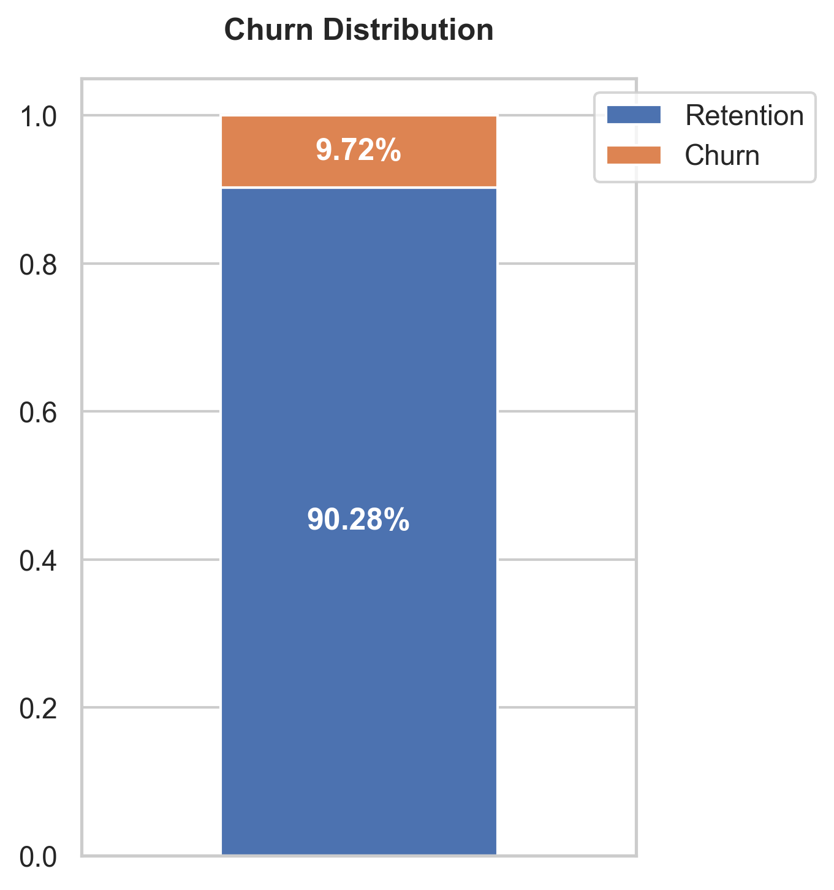
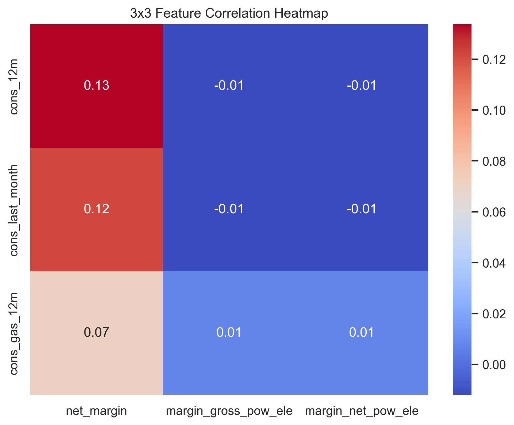
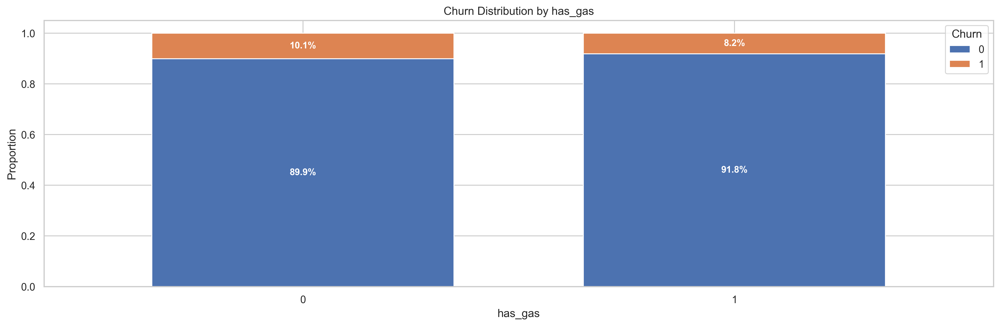

# ⚡ PowerGuard: Strategic Customer Retention & Profitability Analysis (Energy Sector)


## 📌 1. Project Summary & Objective
Customer churn (the rate at which customers stop doing business with a company) is one of the most significant revenue drains in the utility and energy sector. This project conducts a comprehensive Exploratory Data Analysis (EDA) on an energy provider's customer base to understand the underlying drivers of churn. 

The primary objective is not just to analyze historical data, but to **translate data patterns into actionable business strategies** that reduce customer attrition, optimize pricing models, and protect the company's profit margins.

## 💼 2. Business Value & Impact
*To Hiring Managers & Business Stakeholders:*

Acquiring a new customer is fundamentally more expensive than retaining an existing one. This project tackles this core business challenge by answering two critical questions: **"Why are our customers leaving?"** and **"How can we stop them without destroying our profit margins?"**

**Key Business Impacts of this Project:**
* **Revenue Protection:** Moves away from the traditional "give a discount to everyone" approach. Instead, it identifies exact moments in the customer lifecycle (e.g., "The Year-2 Cliff") where intervention is needed.
* **Smart Budget Allocation (Value-at-Risk):** Introduces the concept of prioritizing retention efforts based on a customer's `net_margin`. This ensures the call center and retention teams focus their budgets on highly profitable B2B clients rather than low-margin accounts.
* **Product Strategy:** Validates that cross-selling (e.g., adding gas services) creates a psychological and practical "lock-in" effect, dropping churn rates to near zero.

## 🛠 3. Technologies & Tools
This project was built with a strong emphasis on Software Engineering best practices, avoiding the common pitfalls of messy data notebooks.
* **Python (3.8+)** - Core programming language.
* **Pandas & NumPy** - Data manipulation and aggregations.
* **Seaborn & Matplotlib** - Advanced, publication-ready statistical visualizations.
* **Standard Libraries (`logging`, `pathlib`, `typing`)** - Used for production-ready code structure, type-hinting, and safe path operations instead of basic `print()` statements.

## 📊 4. Data Description
The analysis leverages two primary datasets:
1. **Client Data (`client_data.csv`):** Contains historical usage, forecast consumption, financial margins, subscribed power (`pow_max`), and the target variable (`churn` - whether the client left over the next 3 months).
2. **Pricing Data (`price_data.csv`):** Historical tracking of peak, mid-peak, and off-peak energy/power prices over time.

## ⚙️ 5. Methodology & Analysis Steps
*To Technical Leads & Data Scientists:*

The EDA is executed using a strictly **functional programming paradigm**. Global states are avoided to ensure code modularity and reusability. 
1. **Robust Data Ingestion:** Implemented safe loading mechanisms using `pathlib` and `try-except` blocks.
2. **Preprocessing & Feature Engineering:** Automated datetime casting and safely mapped categorical boolean variables (e.g., `has_gas`).
3. **Statistical Distribution Analysis:** Analyzed numerical distributions (consumption, forecasts) using stacked histograms and boxplots to isolate outliers (such as extreme margin variances).
4. **Correlation Analysis:** Developed targeted heatmaps to check the multicollinearity between energy consumption features and financial margins.
5. **Categorical Profiling:** Used normalized cross-tabulations to visualize churn proportions across different sales channels and product combinations.

## 💡 6. Executive Summary & Strategic Insights

After deep-diving into the data, 4 major business insights were uncovered:

* **📉 The "Year-2 Cliff":** 27.3% of churn happens exactly in the customer's second year. Customers experience "bill shock" when first-year promotions end. 
  * *Strategy:* Launch a proactive **"Month-9 Trigger"** campaign offering loyalty perks (not margin-eating discounts) to secure renewals before the contract ends.
* **🛡️ Cross-Selling as a Retention Shield:** Customers with both electricity and gas (`has_gas = 1`), or those with 5+ products, have a churn rate of nearly 0%. 
  * *Strategy:* Restructure sales KPIs to heavily incentivize cross-selling to single-product clients.
* **⚡ The Power Discrepancy:** Customers paying for high maximum power (`pow_max`) but consuming little energy churn frequently due to high fixed fees. 
  * *Strategy:* Proactively contact these users to "optimize their tariff." Lowering their fixed cost builds immense trust and guarantees long-term loyalty.
* **💰 Value-at-Risk (VaR) Prioritization:** The data shows massive outliers in `net_margin`. 
  * *Strategy:* Future predictive models must multiply "Churn Probability" by "Net Margin" to calculate **Expected Financial Loss**. Retention teams must work queues based on this financial metric, protecting the most valuable accounts first.

## 📈 7. Visualizations
*(Note to recruiters: The code generates high-quality visual plots. Below are some key snapshots of the analysis.)*

<details>
<summary><b>Click to expand and view the Visual Insights</b></summary>

### Overall Churn Distribution

*(Insert your generated `churn_distribution.png` in the plots folder)*

### Feature Correlation Heatmap (Consumption vs Margins)

*(Insert your generated `feature_correlation_heatmap.png` in the plots folder)*

### Churn by Categorical Features

*(Insert your generated `categorical_churn_stacked_bars.png` in the plots folder)*

</details>

## 🚀 8. How to Run (Local Setup)
To reproduce the analysis locally:

1. **Clone the repository:**
   ```bash
   git clone https://github.com/YourUsername/PowerGuard-Churn-Analysis.git
   cd PowerGuard-Churn-Analysis
   ```
2. **Ensure Data is in place:**
   Place the `client_data.csv` and `price_data.csv` files inside a `data/` directory at the root level.
3. **Install Dependencies:**
   ```bash
   pip install pandas matplotlib seaborn
   ```
4. **Execute the Notebook:**
   Run `eda.ipynb` block by block in Jupyter or VS Code. The code is designed to automatically generate a `plots/` folder and save high-resolution visual outputs.

---
**Author:** [Sənin Adın/Soyadın]  
**Contact:** [LinkedIn Profilin] | [Email Ünvanın]  
*Turning raw data into strategic business value.*